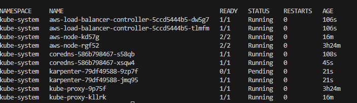

# Terraform ile AWS Infrasutructure

Bu proje, AWS üzerinde bir altyapı kurmak için Terraform kullanarak oluşturulmuş bir modüler yapı içerir. Bu yapı, çeşitli modülleri bir araya getirerek EC2, VPC, OpenVPN, EKS ve RDS gibi AWS hizmetlerini yönetir.

## Gereksinimler

Bu projeyi çalıştırmak için aşağıdaki araçlara ihtiyacınız olacak:

- [Terraform](https://www.terraform.io/downloads.html) v0.12 veya üstü
- [AWS CLI](https://aws.amazon.com/cli/)
- Bir AWS hesabı

## Kullanım

```sh
git clone https://github.com/AbdullahPelit/terraform-infra.git
cd terraform-infra
```
### Değişken Tanımlama

./main/variables.tf dosyası içerisinde "cluster name, account ID vb." değişkenleri tanımlayın.

sonrasında main klasoru içerisinde projenin gereksinimlerini indirmek için

terraform init

çalıştırdıktan sonra 

terraform plan ile oluşturulacak dosyaların neler olduğunu teyit edin. Daha sonra 

terraform apply ile projeyi çalıştırın.

Proje Kapsamında oluşturulucak servisler şunlardır:

- VPC
- Network elemanları
- OpenVPN için Ec2
- EKS
- Node Group
- Load Balancer Kontroller
### Extentionlar
- Argocd (Defaultta kapalı)
- Grafana,Prometheus, Metric server(Default Kapalı)

Bu servisler henüz tam olarak test edilmedi bu yüzden kapalı.

Infrasutructure yapımız tamamlandıktan sonra. 

Oluşturulan ec2'ya connect olup kendimize bir VPN oluşturuyor. Daha sonra bu VPN ile 
- aws eks --region <region> update-kubeconfig --name <cluster_name>
komutunu çalıştırıp cluster'a bağlanıyoruz.

- kubectl get nodes


Autoscaling için karpenter kullanıyoruz. Karpenter dikeyde nodeları scale edebilmemize yarıyor. cluster autoscaler'a benzer bir yapıda bu proje özelinde tercihen Karpenter kullanıyoruz. 

- https://karpenter.sh/docs/getting-started/migrating-from-cas/

Dokümanındaki her adım takip edilerek karpenter kurulumunu gerçekleştiriyoruz. Doküman haricinde NodePool kısmında spot yerine on-deamand capacity-type'ını giriyoruz. Cost-effective olması açısından spot önerilen kullanım şeklidir.



## GitOps Workflow

Deployment için argocd kullanıyoruz. 

- https://argo-cd.readthedocs.io/en/stable/getting_started/

Dokümanı takip edilerek argo cd kurulumu yapıyoruz. Kubernetese kurduğumuz argocdnin servisi ile localde argcd'ye gidiyoruz. Şifre ve nasıl port-forward yapılacağı dokümanda belirtiliyor. 


- https://github.com/aspnetrun/run-devops örnek bir uygulama buluyoruz birden fazla microservice kullanan. 

New App diyip gerekli adımları girerek deploymentı tamamlıyoruz. 


Daha sonra autoscalingi test etmek için uygulamalardan birinin deploymentını editleyip replica sayısını 20ye çıkarıyoruz ve karpenterın 2 node daha oluşturduğunu görüyoruz.


## Montoring

Burada EKS applicationları monitor etmek için Cloudwatch insight kullanacağız. 

Bunun için öncelikle cluster'a cloudwatch agent ve fuluent-bit kurulumunu aşağıdaki linkteki dokümandan takip ederek yapıyoruz.

- https://docs.aws.amazon.com/AmazonCloudWatch/latest/monitoring/Container-Insights-setup-EKS-quickstart.html

Daha sonra aws consoledan cloudwatch servisine gidip insight'a tıkladığımızda orada metricleri ve logları görüntüleyebiliriz.

## Secret Manager Integration EKS

Burada uygulama herhangi bir secret manager kullanımına uygun olmadığı için teorik olarak işlenmiştir. Kullanımını detaylı görmek için aşağıdaki doküman takip edilebilir. Buradaki örnekte secret-csi-driver kullanılmıştır. 

- https://waswani.medium.com/integrating-secrets-manager-with-aws-eks-79c93e70c74e

Bu kullanıma alternatif olarak eğer jenkins gibi ci/cd toolları kullanıyorsanız. Stagelerden birinde secret managerdaki değişkenleri vault'a yazıp uygulamanızın vaulttan kullanmasını veya direkt secret kind üreterekte bunu yapabilirsiniz.


